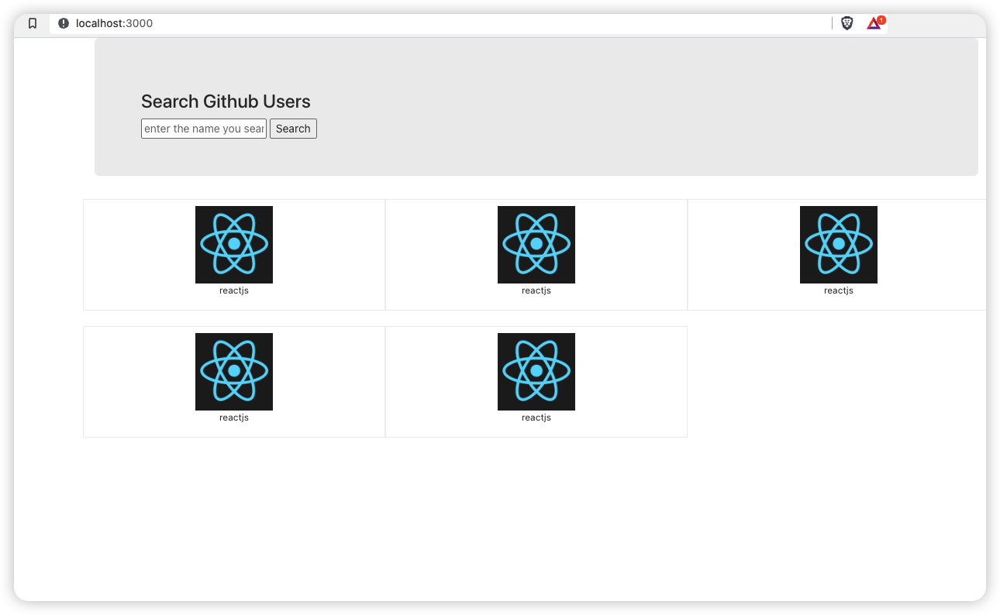

# Intro

Following the [class 67](https://www.bilibili.com/video/BV1wy4y1D7JT/?p=67&vd_source=8db9aed6fce93c76e5e70916df97c4be),

# How to Use

## Starting point

The starting code is inside `./start/github-search` folder.

Go there, install all the packages you will need via `npm i`, then check whether it is successful via `npm start`.

If success, you shall see the following image:



Feel free to update it directly on the start folder, but the better way will be reconstruct the start folder to a new folder and modify it over there (which will make github sync easier.) Notice that a simple `cp -r` will not be sufficient. To do so, do the following steps:

```
mkdir end
cd end
npx create-react-app github-search
cd github-search
cp -r ../../start/github-search/public/css ./public/css
cp ../../start/github-search/public/index.html ./public/index.html

cp ../../start/github-search/src/App.css ./src/App.css
cp ../../start/github-search/src/index.css ./src/index.css
cp ../../start/github-search/src/App.js ./src/App.js

npm start // shall display
```

## Tasks:

1. (P67) finish the starting point step above
2. (P67) refactor the components (`List` and `Search`)
3. (P68) add search method for `Search` component (example github link: `https://api.github.com/search/users?q=xxx`)
4. (P68) test the github api mock server at `server` folder (go there, `npm start`, check the content in `http://localhost:5000/search/users?q=xxx`)

> note on step 4: port 5000 on mac is occupied by the system, thus will need to use a different port. The server may not work but the `users2` shall work as expected.

5. (P68) set up proxy (via `package.json` or use the `setupProxy.js`)

> note: if the proxy server not working properly, can move forward with using the github api.

6. (P69) pass user data from search component to list component (users and setUsers)

7. (P70) add loading, welcome words for first time user and error message.

## Solution

Check the end folder for my solution.
